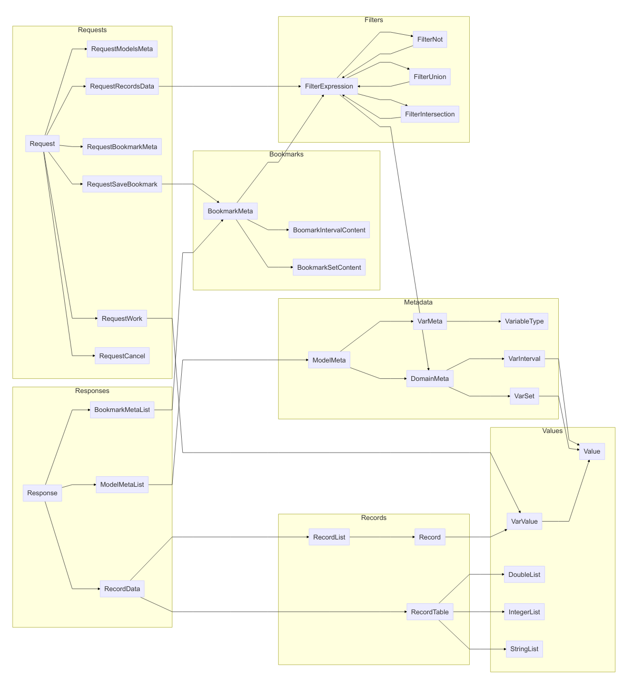

# Overview

Client-server communication in the Records API simply consists of clients sending [`Request`](#EsdaRecords.Request) messages to the server and servers asynchronously sending [`Response`](#EsdaRecords.Response) messages to the client. The [request and response messages](#requests-and-responses) hold the specifics of the request or response and the responses are correlated with the requests; however, it is important to note that multiple responses may occur for a single request, as when record data are chunked into multiple response, or that an error response may be sent at any time. The nested messages within `Request` and `Response` may in turn contain nested fields and messages providing further details. The table below shows the correspondence between requests and responses, while the figure following that shows the containment relationships between message types. 

| Request Field                                       | Response Field                                          |
|-----------------------------------------------------|---------------------------------------------------------|
| [`models_metadata`](#EsdaRecords.RequestModelsMeta) | [`models`](#EsdaRecords.ModelMetaList) or `error`       |
| [`records_data`](#EsdaRecords.RequestRecordsData)   | [`data`](#EsdaRecords.RecordData) or `error`            |
| [`bookmark_meta`](#EsdaRecords.RequestBookmarkMeta) | [`bookmarks`](#EsdaRecords.BookmarkMetaList) or `error` |
| [`save_bookmark`](#EsdaRecords.RequestSaveBookmark) | [`bookmarks`](#EsdaRecords.BookmarkMetaList) or `error` |
| [`cancel`](#EsdaRecords.RequestCancel)              | no response or `error`                                  |
| [`work`](#EsdaRecords.RequestWork)                  | [`data`](#EsdaRecords.RecordData) or `error`            |

Table: Correlation between requests and responses.

[Metadata messages](#metadata) describe "models", which are just sources of data, and the variables they contain. [Data record messages](#data-records) hold the data itself. Data records are simply tuples of real numbers, integers, and character strings, where each data value is tagged by a variable name, according to a pre-defined schema, and each record is assigned a unique integer identifier. Conceptually, these records are isomorphic to rows in a relational database, JSON objects, or key-value maps. For efficiency and compactness, [`RecordData`](#EsdaRecords.RecordData) may be provided in [list format](#EsdaRecords.RecordList) or [tabular format](#EsdaRecords.RecordTable), with the latter format obtained only when the contents of the table all have the same data type. The data records may be provided *in toto* or filtered using [filter messages](#filtering) so that only certain fields or records are returned. The API contains a small embedded language for [filtering via set and value operations](#EsdaRecords.FilterExpression). Sets of records may be [bookmarked](#bookmarks) for sharing or later retrieval by (i) enumerating their unique record identifiers, (ii) defining a range of unique record identifiers, or (iii) specifying a filtering criterion.

Servers that perform computations or simulations can receive input parameters via a [`RequestWork`](#EsdaRecords.RequestWork) message that contains those input parameters. After the server has completed its computations, it sends the results as [`RecordData`](#EsdaRecords.RecordData) messages.

In general the response to a request for data records comes in *chunks* numbered in sequence, where each chunk has an identifier, `chunk_id`, and the response specifies the identifier of the next chunk, `next_chunk_id`. Thus, the chunks form a linked list. The sending of additional chunks can be cancelled using a [`RequestCancel`](#EsdaRecords.RequestCancel) message. If the [`subscribe`](#EsdaRecords.Request) flag is set when making a request, the server will respond indefinitely with additional data as it becomes available, until the subscription is [cancelled](#EsdaRecords.RequestCancel).
