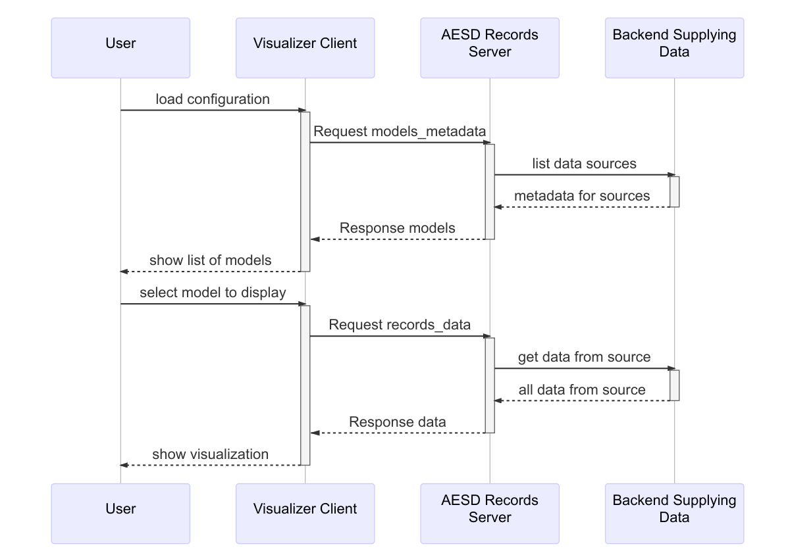
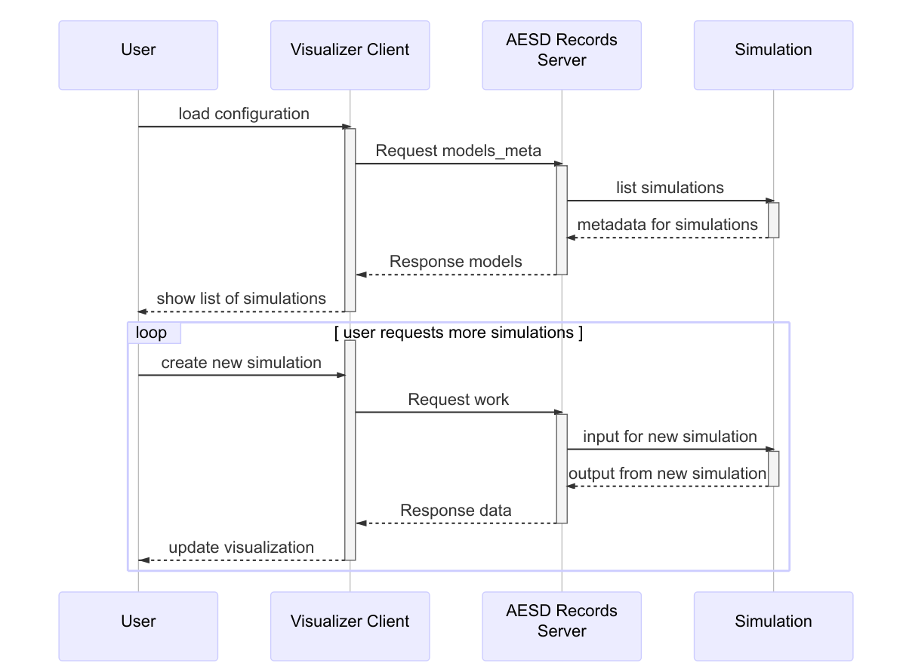
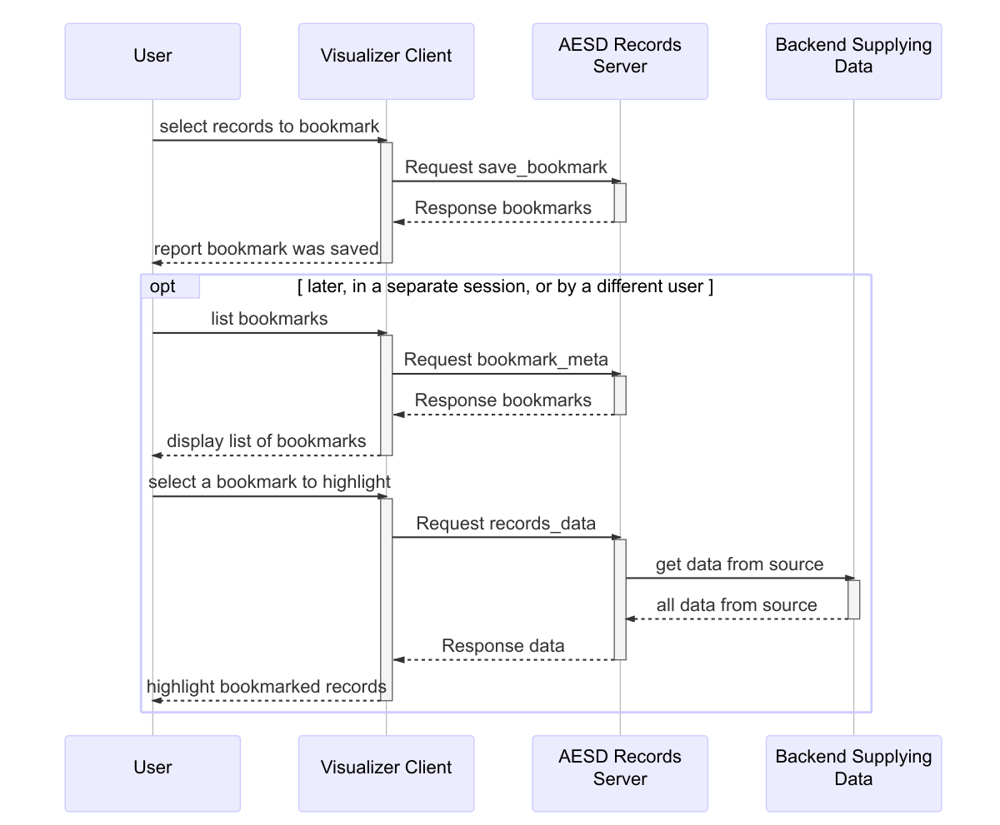

# Use Cases

In this section we outline some standard use cases for the Records API. UML Sequence Diagrams [@fowleruml] illustrate the flow of messages and the messages themselves are printed in the text format output by the Google `protoc` tool [@protoc].

## Static Data

The retrieval of static data records forms the simplest use case for the Records API. A user chooses a particular data source (a "model" in the parlance of the Records API) and then the data are retrieved and displayed. The visualization client software communicates with a Records server, which in turn accesses the static data. The figure below illustrates the process.

A [`Request`](#EsdaRecords.Request) without `model_id` specified requests the server to list all models:

	version: 4
	id: 1
	models_metadata {
	}

The [`Response`](#EsdaRecords.Response) from the server provides metadata for all of the models:

	version: 4
	id: 1
	models {
	  models {
	    model_id: "example-model-1"
	    model_name: "Example Model #1"
	    model_uri: "http://esda.nrel.gov/examples/model-1"
	    variables {
	      var_id: 0
	      var_name: "Example Real Variable"
	      type: REAL
	    }
	    variables {
	      var_id: 1
	      var_name: "Example Integer Variable"
	      type: INTEGER
	    }
	    variables {
	      var_id: 2
	      var_name: "Example String Variable"
	      type: STRING
	    }
	  models {
	    model_id: "example-model-2"
	    model_name: "Example Model #2"
	    model_uri: "http://esda.nrel.gov/examples/model-2"
	    variables {
	      var_id: 0
	      var_name: "POSIX Epoch"
	      type: INTEGER
	    }
	    variables {
	      var_id: 1
	      var_name: "Measurement"
	      type: REAL
	    }
	  }
	  models {
	    model_id: "example-simulation-3"
	    model_name: "Example Simulation #3"
	    model_uri: "http://esda.nrel.gov/examples/simulation-3"
	    variables {
	      var_id: 0
	      var_name: "Input"
	      type: REAL
	    }
	    variables {
	      var_id: 1
	      var_name: "Time"
	      type: REAL
	    }
	    variables {
	      var_id: 2
	      var_name: "Value"
	      type: REAL
	    }
	    inputs {
	      var_id: 0
	      interval {
	        first_value: 0
	        second_value: 100
	      }
	    }
	  }
	}

Note that the response above is tagged with the same `id` as the request: this allows the client to correlate responses with the particular requests it makes. Next the user might request three records from the first model:

	version: 4
	id: 2
	records_data {
	  model_id: "example-model-1"
	  max_records: 3
	}

The record data might be returned as two chunks, where the first chunk is

	version: 4
	id: 2
	chunk_id: 1
	next_chunk_id: 2
	data {
	  list {
	    records {
	      record_id: 10
	      variables {
	        var_id: 0
	        value: 10.5
	      }
	      variables {
	        var_id: 1
	        value: -5
	      }
	      variables {
	        var_id: 2
	        value: "first"
	      }
	    }
	    records {
	      record_id: 20
	      variables {
	        var_id: 0
	        value: 99.2
	      }
	      variables {
	        var_id: 1
	        value: 108
	      }
	      variables {
	        var_id: 2
	        value: "second"
	      }
	    }
	  }
	}

and the last chunk is:

	version: 4
	id: 2
	chunk_id: 2
	next_chunk_id: 0
	data {
	  list {
	    records {
	      record_id: 30
	      variables {
	        var_id: 0
	        value: -15.7
	      }
	      variables {
	        var_id: 1
	        value: 30
	      }
	      variables {
	        var_id: 2
	        value: "third"
	      }
	    }
	  }
	}

## Dynamic Data

As shown in the following figure retrieving data from a dynamic source proceeds quite similarly to retrieving data from a static source.  The only essential difference is that the server repeatedly sends additional responses containing new data, until a request to cancel is sent.

When requesting dynamic data, it is advisable to set the `subscribe` flag in the request for data:

	version: 4
	id: 2
	subscribe: true
	records_data {
	  model_id: "example-model-2"
	}

The [`RequestCancel`](#EsdaRecords.RequestCancel) message is the `cancel` field [`Request`](#EsdaRecords.Request) and must include the `id` of the request to be cancelled:

	version: 4
	cancel {
	  id: 2
	}

## Simulations

The model `Example Simulation #3` in the Static Data use case is a simulation model, as evidenced by the presence of the `inputs` field in its metadata. The following figure shows a typical interaction with a simulation-based model via the Records API.

The [`RequestWork`](#EsdaRecords.RequestWork) message, which is contained in the `work` field of a [`Request`](#EsdaRecords.Request), specifies the input for a simulation to be run:

	version: 4
	id: 3
	work {
	  model_id: "example-simulation-3"
	  inputs {
	    var_id: 0
	    value: 50
	  }
	}

The response to this message will be data for the result of the simulation.

## Bookmarks

Once data from a model is loaded, it may be bookmarked. One simply supplies a description of the data to be bookmarked. Bookmarks can be listed and loaded, as shown in the following figure.

To create a bookmark for a specific list of records, simply supply their record identifiers as part of a [`BookmarkMeta`](#EsdaRecords.BoomarkMeta) message in the `save_bookmark` field of [`Request`](#EsdaRecords.Request):

	version: 4
	id: 4
	save_bookmark {
	  model_id: "example-model-1"
	  new_bookmark {
	    bookmark_name: "Sample Bookmark"
	    set {
	      record_ids: 10
	      record_ids: 30
	    }
	  }
	}

The response will be the same bookmark, but with the `bookmark_id` field added:

	version: 4
	id: 4
	bookmarks {
	  bookmark_metas {
	    bookmark_id: "bookmark-1"
	    bookmark_name: "Sample Bookmark"
	    set {
	      record_ids: 10
	      record_ids: 30
	    }
	  }
	}

The user or another user can retrieve the records corresponding to the bookmark:

	version: 4
	id: 5
	records_data {
	  model_id: "example-model-1"
	  bookmark_id: "bookmark-1"
	}

This will return precisely the bookmarked records:

	version: 4
	id: 5
	data {
	  list {
	    records {
	      record_id: 10
	      variables {
	        var_id: 0
	        value: 10.5
	      }
	      variables {
	        var_id: 1
	        value: -5
	      }
	      variables {
	        var_id: 2
	        value: "first"
	      }
	    }
	    records {
	      record_id: 30
	      variables {
	        var_id: 0
	        value: -15.7
	      }
	      variables {
	        var_id: 1
	        value: 30
	      }
	      variables {
	        var_id: 2
	        value: "third"
	      }
	    }
	  }
	}

## Filtering

Filtering records can be used to select particular records for retrieval, via the [`RequestRecordsData`](#EsdaRecords.RequestRecordsData) message, or in defining bookmarks, via the [`BookmarkMeta`](#EsdaRecords.BookmarkMeta) message. Filtering of records is accomplished through expressions, [`FilterExpression`](#EsdaRecords.FilterExpression), combining values for variables, [`DomainMeta`](#EsdaRecords.DomainMeta), and the set operators not, union, and intersection, encoded in the messages [`FilterNot`](#EsdaRecords.FilterNot), [`FilterUnion`](#EsdaRecords.FilterUnion), and [`FitlerIntersection`](#EsdaRecords.FilterExpression), respectively. For example, the expression $x \le 20$ would be expressed as the following [`FilterExpression`](#EsdaRecords.FilterExpression)

	filter_domain {
	  interval {
	    var_id: 0
	    last_value: 20
	  }
	}

provided that $x$ has `var_id = 0`. The expression $( 10 \le x \le 20) \cup ( y \notin \{ 4, 7 \})$ would be expressed as

	filter_union {
	  filter_expressions {
	    filter_domain {
	      var_id: 0
	      first_value: 10
	      last_value: 20
	    }
	    filter_not {
	      filter_expression {
	        filter_domain {
	          var_id: 1
	          set {
	            elements: 4
	            elements: 7
	          }
	        
	      }
	    }
	  }
	}

provided that $x$ has `var_id = 0` and $y$ has `var_id = 1`.
