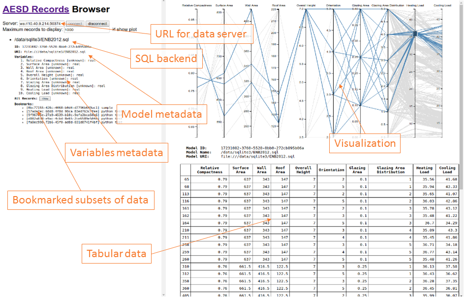

## JavaScript Client Library and Web-Based Browser

The client library for JavaScript relies on a few simple functions to interact with an AESD server.
Full documentation for the JavaScript client library is a available at <<http://github.com/NREL/AESD/lib/javascript>>.  The figure below shows the user interface of the general purpose AESD records browser using this JavaScript library.

### Connect to a server

	connect(wsURL)

Here `wsURL` is simply the URL of the server, for instance `ws://10.40.9.214:503761`.  This returns a connection object.

### Disconnect from a server

	disconnect(connection)

Here `connection` is the connection object returned by the `connect` function.

### Retrieve list of data models

	requestModelsMetadata(connection, modelId, notify, notifyError)

Here `connection` is the connection object return by the `connect` function and `modelId` is the string identifying the model, or `null` if metadata for all models is requested.  After all of the model metadata have been retrieved, the `notify` function is called with the list of model metadata objects as its argument; if an error occurs, then `notifyError` is called with the error message as its argument.  The function `requestModelsMetadata` returns a result object that contains a field `done` indicating whether all model metadata have been retrieved and a field `models` listing the model metadata retrieved so far.

### Retrieve data records

	requestRecordsData(connection, modelId, maxRecords, variableIds, bookmarkId, notify, notifyError)

Here `connection` is the connection object return by the `connect` function and `modelId` is the string identifying the model.  After all of the data records have been retrieved, the `notify` function is called with the list of data records as its argument; if an error occurs, then `notifyError` is called with the error message as its argument.  The `maxRecords` argument specifies the maximum number of records to retrieve, `variableIds` may list the variables of interest, and `bookmarkId` restricts the results to bookmarked records.  The function `requestRecordsData` returns a result object that contains a field `done` indicating whether all data records have been retrieved and a field `data` listing the data records retrieved so far.

### Retrieve list of bookmarks

	requestBookmarkMeta(connection, modelId, bookmarkId, notify, notifyError)

Here `connection` is the connection object return by the `connect` function, `modelId` is the string identifying the model, and `bookmarkId` is the string identifying the bookmark, or `null` if metadata for all bookmarks is requested.  After all of the bookmark metadata have been retrieved, the `notify` function is called with the list of bookmark metadata as its argument; if an error occurs, then `notifyError` is called with the error message as its argument.  The function `requestBookmarkMeta` returns a result object that contains a field `done` indicating whether all bookmark metadata have been retrieved and a field `bookmarks` listing the bookmark metadata retrieved so far.

### Create/update a bookmark

	requestSaveBookmark(connection, modelId, name, filter, notify, notifyError)

Here `connection` is the connection object returned by the `connect` function, `modelId` is the string identifying the model, and `bookmarkId` is null for a new bookmark or the identifier for a bookmark being updated.  The `name` field names the bookmark and the `filter` object describing the filtering operation for the bookmark.  After the bookmark metadata has been created or updated, the `notify` function is called with the list of bookmark metadata as its argument; if an error occurs, then `notifyError` is called with the error message as its argument.  The function `requestSaveBookmark` returns a result object that contains a field `done` indicating whether all bookmark metadata have been retrieved and a field `bookmarks` listing the bookmark metadata retrieved so far.
