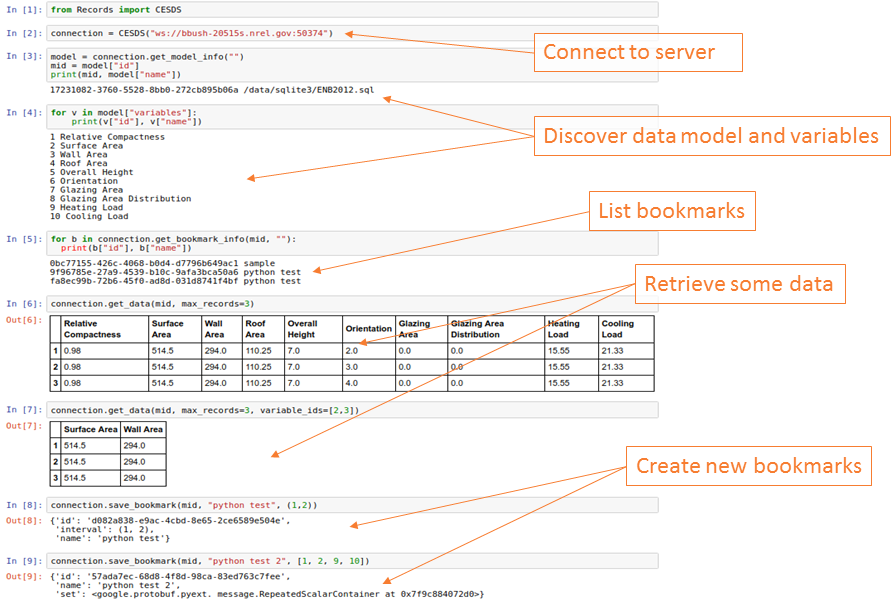

## Python Client Library

Full documentation for the Python client library is a available at <<http://github.com/NREL/AESD/lib/python>>.

### Client API

**`new_server(self, server_url)`**

	Change server url to which websocket will connnect
	Parameters
	----------
	server_url : 'string'
	    server url
	 
	Returns
	---------
	self.url : 'string'
	    server url

**`send(self, request)`**

	Closes event_loop
	Parameters
	----------
	request : 'proto.request'
	    proto request message
	timeout : 'int'
	    timeout in seconds for connection
	 
	Returns
	---------
	response : 'list'
	    List of responses from the server, each response is a proto message

**`get_model_info(self, model_id)`**

	Sends request of model metadata and extracts response
	Parameters
	----------
	model_id : 'string'
	    Id of model for which to requst models_metadata
	    if None requests all models
	 
	Returns
	-------
	model_info : 'list'|'dict'
	    List of model's metadata dictionaries for each model in models or
	    dictionary for model_id

**`get_data(self, model_id, max_records=1000, variable_ids=None, bookmark_id=None)`**

	Sends request of model metadata and extracts response
	Parameters
	----------
	model_id : 'string'
	    Id of model for which to requst records_data
	max_records : 'int'
	    Number or records being request (0 will return all records)
	variable_ids : 'list'
	    List of variable ids (ints) to be requested
	    Will be returned in same order as request
	    Default=None, all variables will be returned (order?)
	bookmark_id : 'int'
	    Request records_data based on bookmark id
	 
	Returns
	-------
	data : 'pd.DataFrame'
	    Concatinated data from each response message
	    Variable ids replaced with names from model_info

**`do_work(self, model_id, inputs)`**

	Sends request of model metadata and extracts response
	Parameters
	----------
	model_id : 'string'
	    Id of model for which to requst records_data
	inputs : 'dict'
	    Dictionary of {var_id: value} pairs
	 
	Returns
	-------
	data : 'pd.DataFrame'
	    Concatinated data from each response message
	    Variable ids replaced with names from model_info

**`get_bookmark_info(self, model_id, bookmark_id)`**

	Sends request of model metadata and extracts response
	Parameters
	----------
	model_id : 'string'
	    Id of model for which to requst bookmark_meta
	bookmark_id : 'string'
	    Id of bookmark for which to request models_metadata
	    if None request all bookmarks
	 
	Returns
	-------
	model_info : 'list'|'dict'
	    List of model's metadata dictionaries for each model in models or
	    dictionary for model_id

**`save_bookmark(self, model_id, name, content)`**

	Sends request to save new bookmark
	Parameters
	----------
	model_id : 'string'
	    Id of model for which to requst bookmark_meta
	name : 'string'
	    Name for new bookmark
	content : 'list'|'tuple'
	    Contents of bookmark
	    list is a bookmark set
	    tuple is a bookmark interval
	 
	Returns
	-------
	model_info : 'list'|'dict'
	    List of model's metadata dictionaries for each model in models or
	    dictionary for model_id

### Example

The figure below shows example usage of the Python Records API client.

